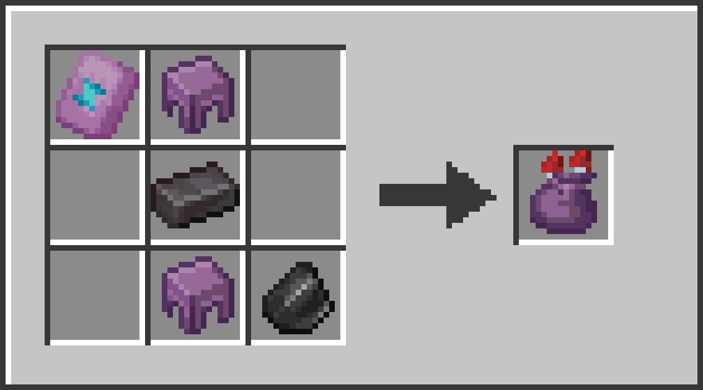

# Rocket Pouch


26.2 Fabric - Store Rockets in a pouch!

The Rocket Pouch holds up to **320 firework rockets** (5 stacks) in a single slot and works like a rocket while it has any inside. The durability bar shows how full it is.

## Crafting



Spire Armor Trim, Shulker Shell, Netherite Ingot, Shulker Shell, Flint - shaped as shown.

## Usage

| Action | Result |
| --- | --- |
| Left-click the pouch with rockets on your cursor | Put them in |
| Pick up the pouch, left-click a stack of rockets | Pull the whole stack in |
| Right-click the pouch with an empty cursor | Take out up to 64 |
| Pick up the pouch, right-click an empty slot | Put a stack of 64 there |
| Right-click while gliding with an elytra | Boost, uses one rocket |
| Right-click a block | Launch a rocket, uses one rocket |

- The pouch holds one kind of rocket at a time. It takes a different kind only when empty.
- Creative mode does not use up rockets.
- The fill bar goes from red (nearly empty) to green (full). The tooltip shows the count and the stored rocket's flight duration and stars.

## Requirements

- Minecraft 26.2
- Fabric Loader 0.19.5 or newer
- Fabric API
- Java 25 or newer

## Building

```
./gradlew build
```

The jar ends up in `build/libs/`.
